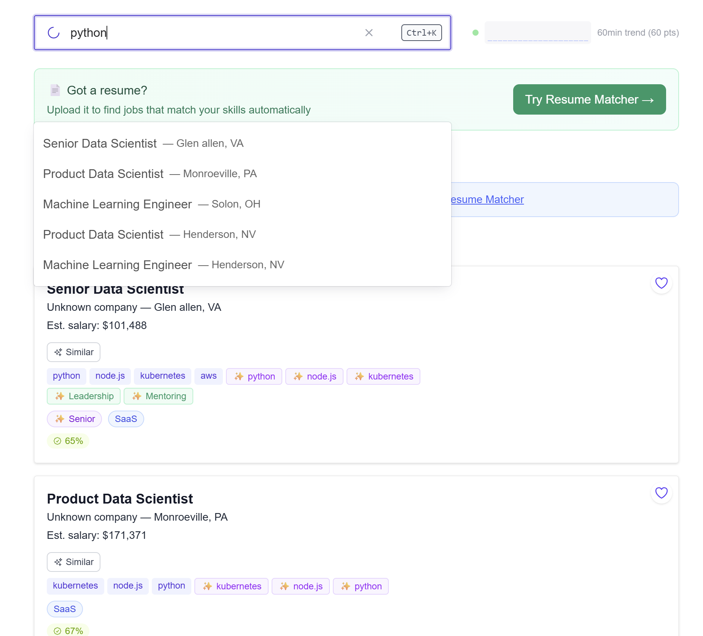
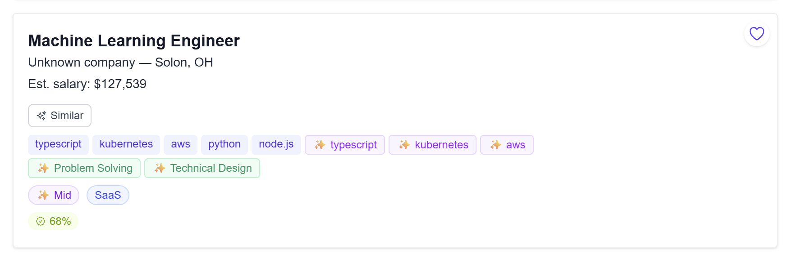
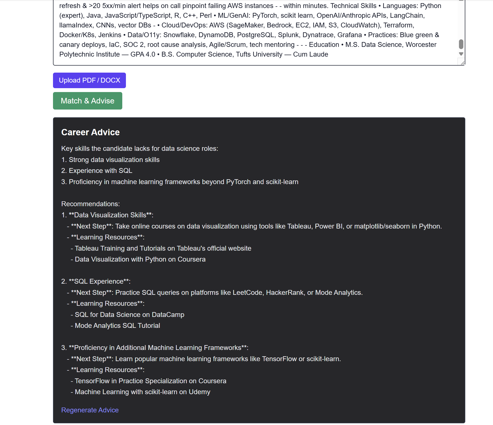
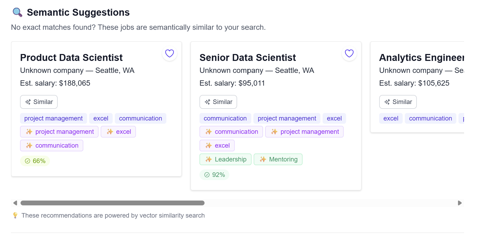

# Career Code Advisor 👩‍💻✨  
Redis‑powered, AI‑augmented job search with real‑time insights.

**Live demo:** https://careercodeadvisor.com  
**Stack:** Next.js (App Router) • Redis 8 (RediSearch + Vector, Streams) • OpenAI • Docker

---

## 🚀 Why this exists
Traditional job boards rely on brittle keyword search and clunky filters. **Career Code Advisor** makes discovery **fast, relevant, and personal** using **hybrid search (full‑text + vectors)**, résumé‑aware matching, and real‑time UI.

---

## ✨ Key Features

- **Résumé → real‑time feedback & matches**  
  Upload or paste your résumé to get immediate, explainable matches. Overlapping skills in each job are highlighted so you can see *why* it’s a fit.

- **Smart search (hybrid + vector + filters)**  
  Natural queries (“*senior react remote*”) work even when wording varies. If text search is sparse, we **fallback to semantic suggestions** so you’re never at zero.

- **Fast faceted filtering**  
  Narrow by location, company, skills, and more. Facet counts update instantly.

- **Autocomplete & Command‑K**  
  Start with **autocomplete**, or press **`Ctrl+K`** for a quick launcher to jump around faster. :contentReference[oaicite:1]{index=1}

- **Saved Jobs + live Dashboard**  
  Save (⭐) roles you like. The **Dashboard** shows a live favorites count and a **60‑minute trend** for activity. :contentReference[oaicite:2]{index=2}

- **Semantic caching**  
  AI analyses (résumé skill extraction, brief coaching snippets) are cached by **embedding similarity** to reduce latency and API cost.

---

## 🧠 How Redis 8 is used

- **Search & recommendations with RediSearch + Vector**  
  Jobs are indexed for full‑text **and** vector KNN. We use this for hybrid search, “similar jobs” recommendations, and **semantic fallback** when exact matches are scarce.

- **Semantic caching (vector index)**  
  For résumé feedback/matching, we store AI outputs alongside an **embedding of the input**. On similar inputs, we retrieve from Redis instead of re‑calling the LLM.

- **Real‑time counters/trend (Streams)**  
  Save/unsave activity is recorded to Redis to support a **live favorites counter** and a **rolling 60‑minute trend** on the Dashboard. (This is how we demonstrate the “real‑time” part of the experience in a visible way.)

## Screenshots
- **Home + Search — live results + filters**


- **Job Modal — badges, overlap highlights, “similar jobs”**


- **Résumé Matcher — paste/upload → ranked matches + coaching**


- **Semantic Suggestions — zero‑result fallback via vectors**


---

## 🗺️ Architecture (high level)

```mermaid
flowchart LR
  subgraph UI["Next.js App (Server Actions + Edge)"]
    A[Search + Filters] --> B[Job Modal & Similar Jobs]
    A --> C[Résumé Matcher]
    D[Saved Jobs] --> E[Dashboard]
    A --> F[Command-K Launcher]
  end

  subgraph Redis["Redis 8 (Stack)"]
    IDX[(RediSearch + Vector)]
    CACHE[(Semantic Cache)]
    STREAM[(Activity Stream)]
    DATA[(Job Docs)]
  end

  A -- text+facets --> IDX
  B -- KNN(similar) --> IDX
  C -- embed input --> IDX
  C -- lookup/store --> CACHE
  D -- save/remove --> STREAM
  E -- counters/trend --> STREAM
  IDX -- ids --> DATA
  DATA --> UI
